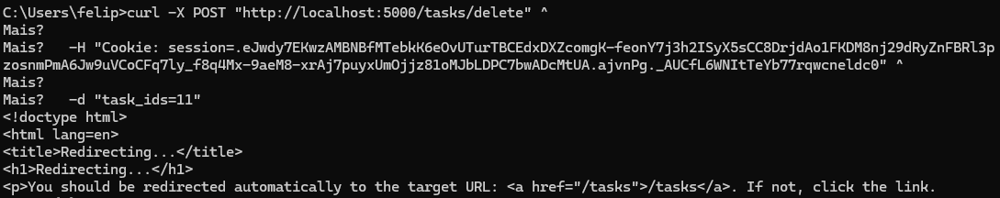
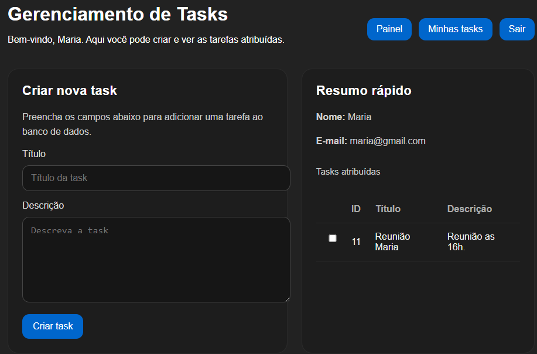
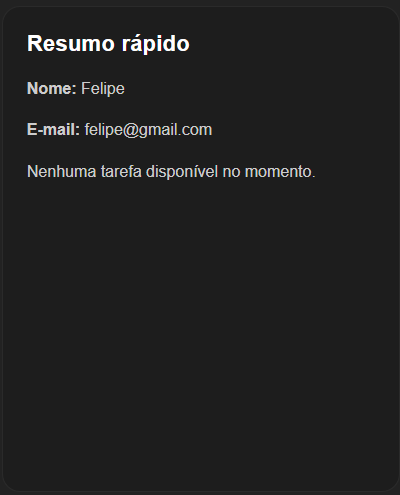

# Broken Access Control (A01:2021) - OWASP Top 10
[Documentação da vulnerabilidade](https://owasp.org/Top10/2025/A01_2025-Broken_Access_Control/)

## Visão geral da vulnerabilidade

Broken Access Control é uma das vulnerabilidades mais críticas listadas no OWASP Top 10 (A01:2021). Ela ocorre quando uma aplicação falha em aplicar corretamente restrições de autorização, permitindo que usuários acessem ou manipulem recursos fora de seus privilégios definidos.

Esse tipo de falha não está relacionado à autenticação (identidade do usuário), mas sim à autorização (o que o usuário pode fazer dentro do sistema após autenticar).

---

## Testes realizados

### Horizontal Privilege Escalation

Vulnerabilidade ocorrida quando não há parâmetro de owner_id na requisição de dados ao banco de dados, visto que, nesta aplicação cada usuário deveria ter acesso a leitura apenas das suas próprias tasks.

A rota /tasks consulta o banco sem filtrar por owner_id, retornando todas as tasks independentemente do usuário autenticado.





No exemplo acima, o usuário logado como "Felipe" consegue visualizar a task criada por "Maria".

---

### Insecure Direct Object Reference (IDOR)

IDOR é uma técnica de ataque da vulnerabilidade Broken Access Control que ocorre o servidor não realiza uma checagem se o usuário possui autorização para realizar determinada ação. Com isso um usuário A consegue manipular um identificador de outro usuário. Neste exemplo, o usuário Felipe consegue enviar task_id de uma task da Maria e exclui-la.

Resumo do teste:
1. Felipe autentica e obtém o ID de uma task de Maria (via listagem)
2. Felipe envia DELETE /tasks/delete/<id_da_task_maria> sem nenhuma verificação de ownership
3. Servidor deleta a task sem checar se Felipe é o dono


Com este ID o usuário A consegue enviar a requisição para exclusão da task de Maria


Com isso as task podem ser deletadas por qualquer usuário.



## Remediação

A correção para ambas as técnicas segue o mesmo princípio: **validar o ownership do recurso antes de qualquer operação**, garantindo que o usuário autenticado só acesse ou manipule dados que lhe pertencem.

### Horizontal Privilege Escalation
Filtrar as queries pelo `user_id` da sessão ativa, impedindo que a listagem retorne recursos de outros usuários.

```sql
SELECT * FROM tasks WHERE user_id = <user_id_da_sessão>
```

### IDOR (Insecure Direct Object Reference)
Além do filtro de listagem, validar o ownership também nas operações de escrita e exclusão, combinando o identificador do recurso com o `user_id` da sessão.

```sql
DELETE FROM tasks WHERE id IN (...) AND user_id = <user_id_da_sessão>
```

Dessa forma, mesmo que um atacante envie IDs arbitrários na requisição, o banco de dados rejeita silenciosamente qualquer operação sobre recursos que não pertencem ao usuário autenticado.


